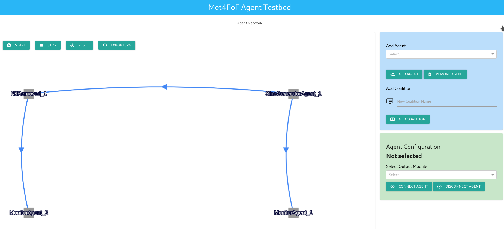
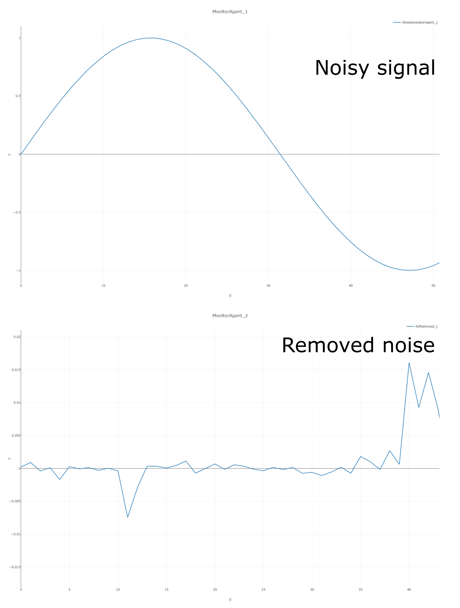

# Bayesian Noise and Jitter removal algorithm – MCMCNJ

This software is "work in progress" and under active development during the next
couple of weeks.

If you have questions get in touch with [the developers](https://github.com/Met4FoF/npl-jitter-noise-removal-mcmc/graphs/contributors).

## Getting started

To get started with this follow these steps:

1. Get a copy of the code via

   `git clone https://github.com/Met4FoF/npl-jitter-noise-removal-mcmc.git`

   or update your copy via

   `git pull`

1. Either use the provided [environment.yml](environment.yml) to create an
   appropriate virtual environment with the correct Python version and
   _agentMET4FOF_ and proceed with step 5. or take the manual installation steps
1. Install Python 3.8
1. Install _agentMET4FOF_'s most current version into your Python environment via

   `pip install agentMET4FOF==0.8.1`
1. In your terminal run

   `python NJ_with_MCMC_agent.py`
1. Visit http://127.0.0.1:8050/ in your local browser
1. You should see something like the following

   
   
